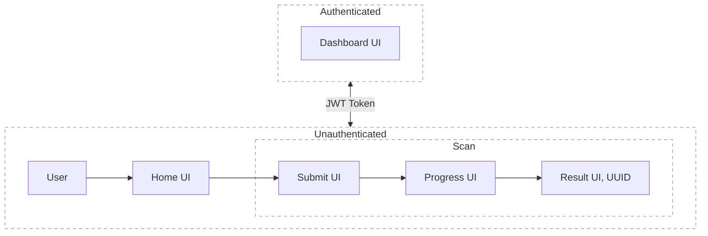

# Git Repository Analysis System

## Features

### Core (MVP)

* **Anonymous & authenticated usage**

  * One sign-in method (Email/Password *or* GitHub OAuth). Sessions are secure; anonymous users can submit scans but with rate/quotas.
* **Repository submission**

  * Accept a public Git repository URL (GitHub/GitLab/Bitbucket). Basic URL validation and helpful error messages.
* **Asynchronous scan pipeline**

  * Background job clones the repo (shallow) and runs analysis. UI shows status and progress in real time.
  * Status model: `queued → running → (succeeded | failed)` with timestamps (queued_at, started_at, finished_at).
* **Shareable result page**

  * Each scan gets a permanent, shareable URL (UUID/short-hash).
* **Result summary (three sections)**

  1. **Description** – Human-readable summary of the project’s purpose and functionality.
  2. **Tech Stack** – Languages, frameworks, build tools, package managers, infra hints.
  3. **Skill Level** – Overall maturity/complexity classified as `Beginner / Junior / Mid-level / Senior` with brief rationale.
* **User dashboard**

  * For signed-in users: list of scan history with filters (status/time), sorting, and link-through to result pages.
* **Error & edge-case handling**

  * Clear feedback for invalid URLs, unreachable repos, private repos, clone/timeout errors, oversized repos/binaries, etc.

### Advanced (phased enhancements)

* **Rate limiting & quotas**

  * Separate policies for anonymous vs authenticated users; burst control and per-IP safeguards.
* **AI-powered analysis**

  * Use a hosted LLM to improve Description/Tech Stack/Skill Level; provider can be swapped via an adapter.
* **Observability & security**

  * Structured logs, metrics, traces; sandboxed workers with CPU/memory/time/network limits.
* **Scalability & resilience**

  * Horizontal workers, exponential backoff/retries, job deduplication, caching of repeated repos.
* **Extensibility**

  * Support more VCS hosts, incremental re-scans, object storage for artifacts and logs.

---

## Architecture Overview

**Design goals**: clean separation of concerns, background job execution, durable results with shareable links, transparent status/errors, easy provider swaps (auth/AI), and safe-by-default scanning.

### Component responsibilities

* **Web UI**

  * Inputs repo URL, shows real-time scan progress (SSE/WebSocket), renders result pages and dashboard.
* **Backend API**

  * REST/GraphQL endpoints for: auth, submit scan, check status, fetch results, list user scans.
  * Enforces auth & rate limits, creates scan records, enqueues background jobs, exposes shareable result URLs.
* **Task Queue (Redis/BullMQ)**

  * Reliable job scheduling, retries, backoff; separates web latency from heavy work.
* **Scanner Worker**

  * Runs in a sandboxed container; performs shallow clone, traverses file tree, detects languages/frameworks via common manifests (e.g., `package.json`, `requirements.txt`, `pom.xml`, `Dockerfile`, `*.csproj`), collects README and key paths, prunes binaries/large files.
* **AI Summarizer**

  * Consumes extracted signals to generate Description/Tech Stack/Skill Level; adapter allows swapping LLM vendors.
* **Data stores**

  * **PostgreSQL** for users, scans, statuses, results, and share tokens.
  * **Redis** for queueing, rate-limit counters, and ephemeral caches.
  * **Object Storage (optional)** for large artifacts and worker logs.

### Data model (high-level)

* `users(id, email, auth_provider, created_at, ...)`
* `scans(id, user_id?, repo_url, status, queued_at, started_at, finished_at, share_token, error_code?)`
* `scan_results(id, scan_id, description, tech_stack_json, skill_level, created_at)`
* `rate_limit_counters(key, window, count, ttl)` *(in Redis)*

### Operational concerns

* **Security**: sandbox workers; block secrets/keys exfiltration; deny-list binary/large files; timeouts per phase.
* **Reliability**: idempotent scans (dedupe by normalized URL + HEAD SHA), retries with limits, circuit breakers for VCS hosts.
* **Observability**: logs (structured), metrics (queue depth, durations, error rates), traces across API → queue → workers.

---

## Setup Instructions

*(To be finalized after tech stack choices are locked; see Deployment Guide for a first pass.)*

## Technology Choices and Rationale

### Frontend

*(Placeholder — will refine once we confirm framework/UI library preferences.)*

### Backend

*(Placeholder — will refine once we confirm language/runtime and hosting constraints.)*

## Deployment Guide

*(Placeholder — will fill after we agree on target infrastructure and CI/CD strategy.)*