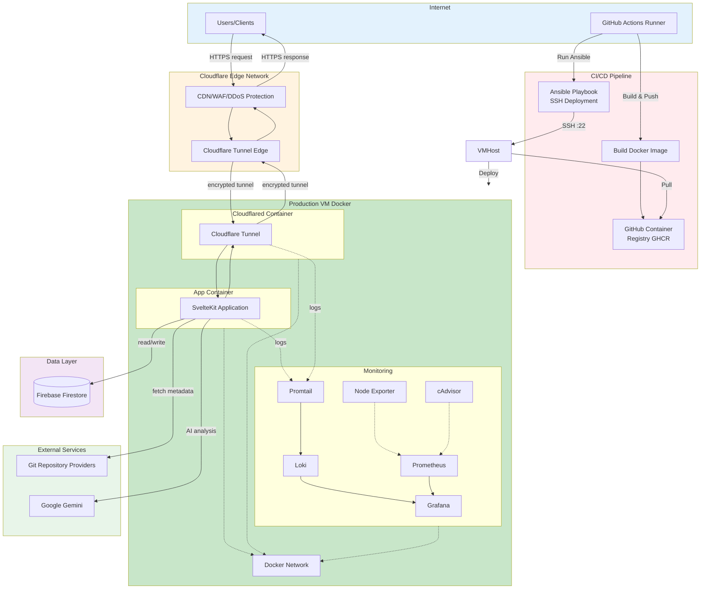

# GitRepoScanner

<div align="center">


***"AI-powered repository analysis tool that provides comprehensive insights into your codebase"***

</div>

## ✨ Features

**🤖 AI-Powered Repository Analysis**
- Paste any GitHub/GitLab/Bitbucket URL and get instant AI insights
- Analyzes tech stack, code quality, complexity, and skill level
- Powered by Google Gemini

**🔗 Share & Compare**
- Every scan gets a permanent shareable URL
- No account needed to view results
- Track your scan history with authentication

**⚡ Smart & Fast**
- Real-time progress updates
- Anonymous users get limited scans, authenticated users get more
- Results include: project description, technologies used, quality score (0-100), and developer skill level assessment

**📊 What You Get**
- **Tech Stack Detection** - Languages, frameworks, tools with confidence scores
- **Code Quality Score** - 0-100 rating with specific improvement suggestions  
- **Complexity Analysis** - Understand what makes the project advanced
- **Skill Level** - Beginner, Junior, Mid-level, or Senior classification
- **Project Structure** - Tests, CI/CD, documentation quality assessment

---


## 🛠️ Technology Choices and Rationale

### Frontend Stack
- **SvelteKit** - Full-stack Framework
- **Svelte 5** - UI Framework with Runes
- **Tailwind CSS 4** - Utility-first Styling
- **Flowbite Svelte** - UI Components
- **Lucide Svelte** - Icon Library

### Backend Stack
- **TypeScript** - Type-safe Programming
- **SvelteKit Server** - Backend Runtime
- **Node.js** - JavaScript Runtime
- **Zod** - Schema Validation & Type Safety

### Database & Authentication
- **Firebase Firestore** - NoSQL Database (User Data & Scans)
- **Firebase Authentication** - Email/Password Auth

### AI & Analysis
- **Google Gemini** - AI Model for Code Analysis

### Infrastructure & Deployment
- **Docker** - Containerization
- **Docker Compose** - Multi-container Orchestration
- **Cloudflare Tunnel (Cloudflared)** - Secure Ingress without Open Ports
- **Cloudflare CDN/WAF** - DDoS Protection & Edge Caching
- **GitHub Actions** - CI/CD Pipeline
- **Ansible** - Deployment Automation & Configuration Management

### Monitoring & Observability
- **Grafana Loki** - Log Aggregation
- **Promtail** - Log Collection
- **Grafana** - Metrics Visualization & Dashboards

---

### 🏗️ System Architecture



---

## 📁 Project Structure

```bash
git-repository-analysis-system/
├── .github/
│   └── workflows/
│       └── deploy.yml              # CI/CD: Build Docker image, push to GHCR, deploy via Ansible
│
├── ansible/                        # Deployment automation
│   ├── deploy.yml                  # Ansible playbook: install Docker, pull image, docker compose
│   ├── inventory.yml               # Target VM inventory
│   └── README.md                   # Deployment setup guide
│
├── config/                        # Monitoring & logging configuration
│   ├── grafana-datasources.yml    # Grafana data source configuration
│   ├── loki-config.yml            # Loki log aggregation settings
│   └── promtail-config.yml        # Promtail log collection settings
│
├── firebase/
│   ├── firestore.indexes.json     # Firestore indexes
│   └── firestore.rules            # Firestore security rules
│
├── scripts/
│   └── scan-repo.ts               # CLI tool for testing scans
│
├── src/
│   ├── lib/
│   │   ├── components/            # Reusable Svelte components
│   │   │   ├── Auth.svelte        # Authentication UI
│   │   │   ├── Avatar.svelte      # User avatar display
│   │   │   ├── RateLimits.svelte  # Quota display
│   │   │   ├── RepoSummary.svelte # Analysis results display
│   │   │   ├── ScanArea.svelte    # URL input & submission
│   │   │   ├── ScanProgress.svelte # Real-time progress display
│   │   │   ├── ScanStatus.svelte  # Scan status indicator
│   │   │   ├── Sidebar.svelte     # Navigation sidebar
│   │   │   └── Welcome.svelte     # Welcome message
│   │   │
│   │   ├── firebase/              # Firebase client SDK
│   │   │   └── index.ts           # Firestore & Auth initialization
│   │   │
│   │   ├── schema/                # Zod schemas & TypeScript types
│   │   │   ├── repository.ts      # Repository & analysis types
│   │   │   ├── scan.ts            # Scan status & error types
│   │   │   ├── user.ts            # User & quota types
│   │   │   └── utils.ts           # Schema utilities
│   │   │
│   │   ├── server/                # Server-side logic
│   │   │   ├── validate/          # Validation logic
│   │   │   │   ├── quota.ts       # Rate limiting & quotas
│   │   │   │   ├── url.ts         # URL validation & parsing
│   │   │   │   └── user.ts        # User validation
│   │   │   ├── analyzer.ts        # Core analysis orchestration
│   │   │   ├── constants.ts       # Server constants
│   │   │   ├── dummy.ts           # Dummy data for testing
│   │   │   ├── firebase.ts        # Firebase Admin SDK setup
│   │   │   ├── git-utils.ts       # Git clone & metadata extraction
│   │   │   ├── llm.ts             # Gemini AI integration
│   │   │   ├── prompt.ts          # AI prompt generation
│   │   │   ├── scan.ts            # Scan creation & background jobs
│   │   │   └── scanInit.ts        # Scan initialization
│   │   │
│   │   ├── stores/                # Svelte stores (state management)
│   │   │   ├── anonymous.ts       # Anonymous user tracking
│   │   │   ├── auth.ts            # Auth state & user data
│   │   │   ├── history.ts         # Scan history
│   │   │   └── scan-status.ts     # Real-time scan tracking
│   │   │
│   │   ├── utils/
│   │   │   └── date.ts            # Date formatting utilities
│   │   │
│   │   └── scan-client.ts         # Client-side scan operations
│   │
│   ├── routes/                    # SvelteKit routes & pages
│   │   ├── api/                   # API endpoints
│   │   │   ├── anonymous/
│   │   │   │   └── +server.ts     # Anonymous user tracking
│   │   │   ├── auth/              # Authentication endpoints
│   │   │   │   ├── signin/
│   │   │   │   │   └── +server.ts # Sign in endpoint
│   │   │   │   └── signout/
│   │   │   │       └── +server.ts # Sign out endpoint
│   │   │   └── scan/
│   │   │       └── +server.ts     # Scan submission endpoint
│   │   │
│   │   ├── dashboard/[id]/
│   │   │   ├── +page.server.ts    # Dashboard server load
│   │   │   └── +page.svelte       # User dashboard page
│   │   │
│   │   ├── scan/[id]/
│   │   │   ├── +page.server.ts    # Scan server load
│   │   │   └── +page.svelte       # Scan progress & results page
│   │   │
│   │   ├── +layout.svelte         # Root layout with navigation
│   │   └── +page.svelte           # Home page with scan submission
│   │
│   ├── app.css                    # Global styles
│   ├── app.d.ts                   # TypeScript declarations
│   ├── app.html                   # HTML template
│   └── hooks.server.ts            # SvelteKit server hooks (auth)
│
├── static/                        # Static assets (empty)
│
├── .env                           # Environment variables (gitignored)
├── .env.example                   # Environment variables template
├── .gitignore                     # Git ignore rules
├── .npmrc                         # npm configuration
├── compose.yml                    # Docker Compose configuration
├── Dockerfile                     # Application container image
├── LICENSE                        # MIT License
├── package.json                   # Dependencies & scripts
├── pnpm-lock.yaml                # Lock file
├── README.md                      # This file
├── service-account-file.example.json # Firebase Admin credentials example
├── service-account-file.json     # Firebase Admin credentials (gitignored)
├── svelte.config.js              # SvelteKit configuration
├── tsconfig.json                 # TypeScript configuration
└── vite.config.ts                # Vite build configuration
```

## 📥 Setup Instructions

### Prerequisites

- **Node.js** 18+ and **pnpm**
- **Firebase project** with Firestore and Authentication enabled
- **Google Gemini API key** (from Google AI Studio)

### Dev Environment Setup

```bash
git clone https://github.com/ryanlinjui/git-repository-analysis-system
cd git-repository-analysis-system
pnpm i
cp .env.example .env # remember to set variables
```

### Firebase Setup
1. Go to [Firebase Console](https://console.firebase.google.com/) to create Firebase Project
2. Create a new project
3. Enable **Firestore Database** (start in production mode)
4. Enable **Authentication** → Email/Password sign-in method
5. Copy rules from `firebase/firestore.rules` to Firebase Console.
6. Get `service-account-file.json` in project root for admin auth.

### Run Development Server

```bash
pnpm dev
```

### Test Repository Scanning

Try scanning a repository:
```
https://github.com/google-gemini/gemini-cli
```

Or use dummy data for testing (no actual clone):
```
https://github.com/dummy/test-repo
```

---

## 🚀 Deployment Guide
### Automated CI/CD Deployment (Recommended)

This project uses **GitHub Actions + Ansible** for automated deployment to your VM. Please refer `[.env.example](.env.example)` for required environment variables and configure [GitHub Secrets](https://docs.github.com/en/actions/security-guides/encrypted-secrets)

### Manual Deployment (Local Development)
```bash
docker compose down
docker compose build
docker compose up -d
```

> `docker compose build --no-cache` forces rebuild without cache if needed.
> Change `compose.yml` to include `build: .` under `app` service for local builds.
    
#### Check status

```bash
docker compose ps
docker compose logs -f app
```

---

## 📝 License

This project is licensed under the MIT License - see the [LICENSE](LICENSE) file for details.
